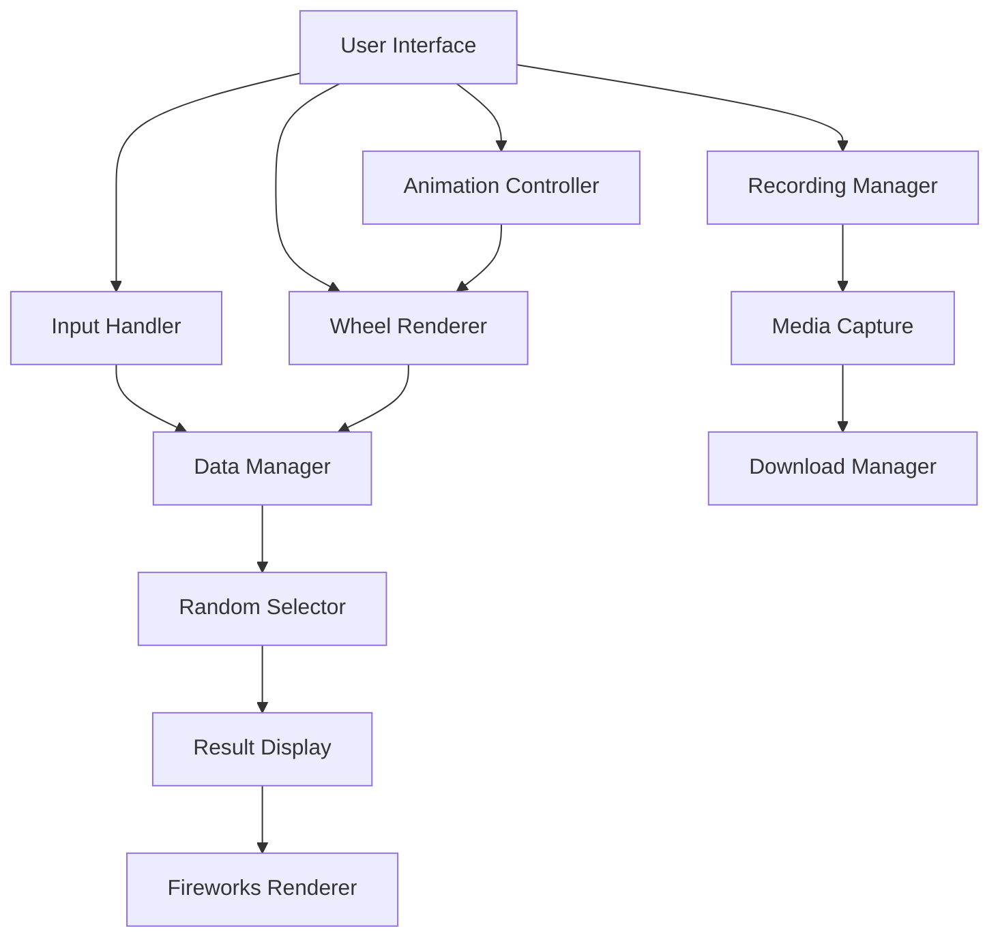

# System Patterns: Name Roulette Wheel

## Architecture Overview
The Name Roulette Wheel application follows a simple client-side architecture with no server component. It's built using vanilla HTML, CSS, and JavaScript, making it easy to deploy and use without any backend dependencies.

## Component Breakdown

### User Interface (UI)
- **HTML Structure**: Defines the layout and elements of the application
- **CSS Styling**: Provides visual styling and responsive design
- **User Interaction**: Captures user inputs and button clicks

### Input Handler
- Manages the dynamic addition and removal of name input fields
- Validates user inputs before processing

### Data Manager
- Collects and processes name data from input fields
- Prepares data for visualization on the wheel

### Wheel Renderer
- Creates and updates the visual representation of the wheel
- Dynamically generates wheel sections based on input names
- Assigns colors and positions to each section

### Animation Controller
- Manages the wheel spinning animation
- Controls timing and easing functions for realistic motion
- Handles the transition between states (static, spinning, result)
- Triggers fireworks animation when result is displayed

### Random Selector
- Implements the random selection algorithm
- Ensures fair and unbiased selection of names
- Calculates final position based on random degree rotation

### Result Display
- Shows the selected name after the wheel stops
- Provides visual feedback during the selection process
- Triggers celebration animations when a winner is selected

### Fireworks Renderer
- Creates particle-based fireworks animations
- Generates random positions and colors for visual variety
- Manages animation lifecycle and cleanup

### Recording Manager
- Handles video recording of the wheel animation
- Provides UI controls for starting and stopping recording
- Manages recording state and visual feedback

### Media Capture
- Uses the MediaRecorder API to capture the animation
- Collects video data chunks during recording
- Processes captured data into a downloadable format

### Download Manager
- Creates downloadable video files from recorded data
- Generates download links for the user
- Handles file format conversion and compatibility

## Design Patterns

### Event-Driven Architecture
The application uses event listeners to respond to user actions, creating a reactive user experience.

### Component-Based Design
Each part of the application has a specific responsibility, making the code modular and maintainable.

### Factory Pattern
Used for creating wheel sections and fireworks particles dynamically based on input data.

### Observer Pattern
Implemented through event listeners that observe user interactions and trigger appropriate responses.

### State Machine
The recording functionality implements a simple state machine to manage recording states (idle, recording, completed).

## Data Flow

### Main Flow
1. User enters names in input fields
2. User clicks "Spin the Wheel" button
3. Input Handler collects and validates name data
4. Data Manager processes the names
5. Wheel Renderer creates the visual wheel with sections for each name
6. Animation Controller initiates the spinning animation
7. Random Selector determines the final position
8. Animation Controller manages the stopping of the wheel
9. Result Display shows the selected name
10. Fireworks Renderer creates celebration animation

### Recording Flow
1. User clicks "Record Spin" button
2. Recording Manager initializes MediaRecorder
3. Media Capture begins recording the wheel container
4. Wheel spinning is automatically triggered
5. When spinning completes or user stops recording:
   - Media Capture finalizes the recording
   - Download Manager creates a video file
   - Download link is presented to the user
